# Comparing-feature-extraction-methods-with-BioTrove-dataset
## Overview
This repo covers a research project that compared different deep learning/machine learning methods for feature extraction in images of living organisms. This project took place in the greater context of the ["clustering-biotrove"](https://www.kaggle.com/competitions/biotrove-clustering/overview) machine learning challenge on Kaggle. This challenge involved a subset of the original [BioTrove](https://baskargroup.github.io/BioTrove/) biodiversity dataset which contains over 160 million images of living organisms with taxonomic information included. The subset simply contained 50k images and **only taxonomic family labels**. The challenge is to use unsupervised learning (no genus or species labels provided) to produce genus- and species-level clusters. See the sections on [original BioTrove dataset](#original-biotrove-dataset) and [Clustering BioTrove Challenge](#clustering-biotrove-challenge) for more information on each respective topic. The general approach of my team, BioTrove_1, was to use a deep learning model for feature/embedding extraction from the images which would then allow for clustering of the images into genus- and species-level groupings. My research question for this project was to compare **four** different feature extraction methods from models that I designed to determine which approach resulted in better-defined embeddings when visualized using UMAP for dimensionality-reduction.

## Note on usage of AI 
LLMs including ChatGPT, Gemini, and the Anaconda Navigator, which uses several open-source LLM models, were used throughout this project to debug code and structure certain sections - particularly the custom dataset class, the supervised contrastive learning loss function, and the supervised contrastive learning model. 

## Scripting language & library
Code is in **Python** and the deep learning package used for analysis is **PyTorch**. 
Code is presented in the form of Jupyter notebooks.

## Repo structure - How to use this repo
**README** file includes the following:
  - Information on the original biotrove dataset
  - Information on the clustering biotrove challenge and the BioTrove data subset used for this challenge
  - An in-depth explanation of the research project/experiment which is the subject matter of this repository
      - Explanation of each of the four feature extraction methods
      - Visualization of embedding(s) of each feature extraction method
  - Discussion of results 

**CODE TO REPRODUCE RESULTS OF EXPERIMENT EXISTS IN THE FOLLOWING FILES**:
  - The **Data Preprocessing** file contains code to load in the clustering biotrove image dataset and metadata (49,633 image subset of original BioTrove dataset with corresponding metadata csv file), perform transforms on images, create custom dataset subclass, and create a dataloader. The **first three** feature extraction methods use the same preprocessing code and as such, a separate data preprocessing notebook file has been uploaded to the main branch of this repo. [Data preprocessing code here](Data_Preprocessing.ipynb). The last method, double-layer ResNet50 + supervised contrastive learning, has **unique data preprocessing code** and so the jupyter notebook for that method **includes the preprocessing steps**. 
  - Each of the four extraction methods has its own, uniquely named file in which you will find a notebook showing the code to run the extraction method and visualize the embeddings. The four extraction method files include:
      - [**Single-layer ResNet50 feature extraction**](single-layer_ResNet50_feature_extraction.ipynb)
      - [**Double-layer ResNet50 feature extraction**](double-layer_ResNet50_feature_extraction.ipynb)
      - [**Double-layer ResNet101 feature extraction**](double-layer_ResNet101_feature_extraction.ipynb)
      - [**Double-layer ResNet50 + supervised contrastive learning feature extraction**](supervised_contrastive_feature_extraction.ipynb)

My recommendation for **reproducing the experiment** is to open up a blank notebook (jupyter, colab, etc.), and **copy and paste the code** from the "Data Preprocessing" notebook and the desired feature extraction method notebook. However, **for the final feature extraction method**, all of the necessary code is kept in one notebook, named "supervised_contrastive_feature_extraction" and so there is **no need to copy and past the data preprocessing code for this particular extraction method**. Each individual file includes the import statements necessary for that specific code at the top and is designed to be ready to use as is. The **only edit necessary** is the addition of your **unique file paths** to the image directory and the metadata csv. **Instructions for downloading the data** are included in the [Data Preprocessing markdown file](Data_Preprocessing.md).

Lastly, a [**Reflection**](Reflection.md) file is included in the main branch to communicate my reflections about the experiemnt: what worked, what didn't, and why?

## Background
### Original BioTrove Dataset
The original BioTrove dataset is described as "the largest publicly accessible dataset designed to advance AI applications in biodiversity". It was curated from the iNaturalist platform as part of an effort spanning several different universities in the United States, and includes 161.9 million images of living organisms with taxonomic information provided in metadata. It was released in 2024. A plethora of information about the original BioTrove dataset, including but not limited to: link to original paper, github repository, and example images, can be found ["here"](https://baskargroup.github.io/BioTrove/).

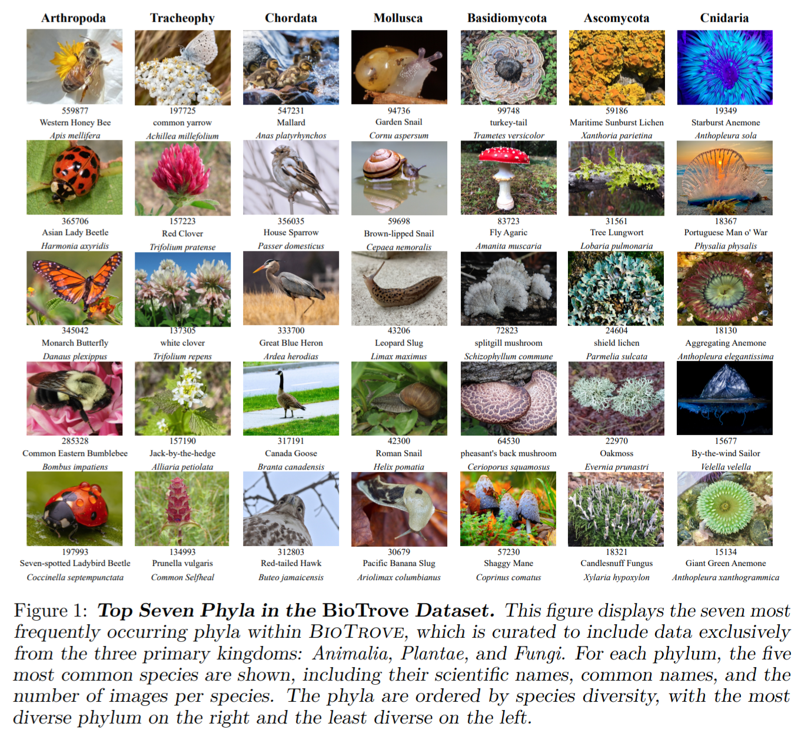
Yang, C.-H., Feuer, B., Jubery, Z., Deng, Z. K., Nakkab, A., Hasan, M. Z., Chiranjeevi, S., Marshall, K., Baishnab, N., Singh, A. K., Singh, A., Sarkar, S., Merchant, N., Hegde, C., & Ganapathysubramanian, B. (2024). Figure 1: Top Seven Phyla in the BioTrove Dataset. In BioTrove: A large curated image dataset enabling AI for biodiversity (NeurIPS Datasets and Benchmarks Track). Advances in Neural Information Processing Systems 37. Neural Information Processing Systems Foundation, Inc. https://doi.org/10.52202/079017-3241

### Clustering BioTrove Challenge

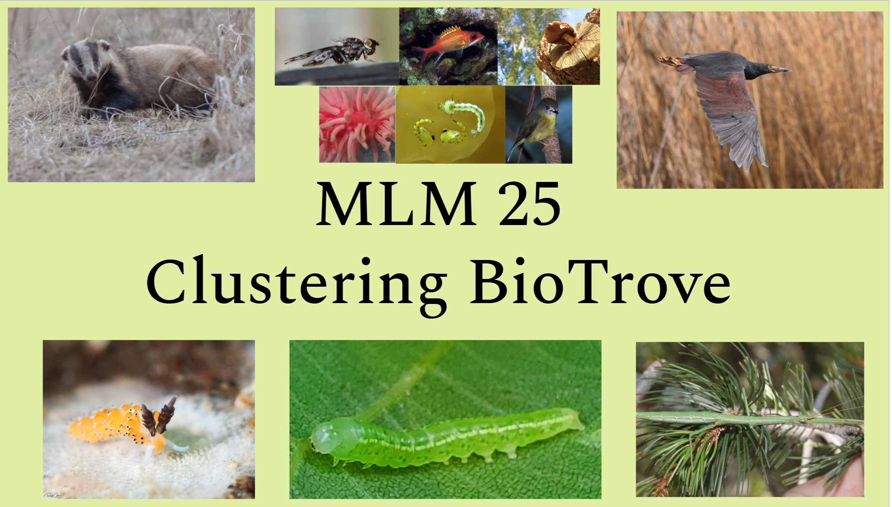

The "Clustering BioTrove" challenge was created by the ML+X machine learning organization from the University of Wisconsin-Madison as part of the 2025 Machine Learning Marathon competition. The challenge included a 49,633 image subset of the original BioTrove dataset with a corresponding metadata csv file that **only included** the unique image identifiers (**hash_id**), and **taxonomic family** names for the images. **179 unique taxonomic families** were represented in the "Clustering Biotrove" dataset. The goal of the challenge was to cluster the ~50k image dataset into genus- and species-level groupings with only the "hash_id" and "family" label provided for each individual image using **unsupervised learning approaches**. As the challenge was unsupervised, there was no ground truth data provided and results were formatted according to the challenge instructions into a csv file and submitted on kaggle for evaluation using the Normalized Mutual Information (NMI) metric. I participated in this challenge in the Fall 2025 semester as part of the "BioTrove_1" team. This experiment occurs in the context of the "clustering-BioTrove" challenge because my team's general approach was to 1) extract image embeddings using a deep learning approach and then 2) cluster these embeddings into genus- and species-level groupings. As such, I spent a lot of time trying to find the best feature extraction method, visualizing embeddings to compare the results of different methods. This formed the basis for this research project which was used as my final project for the EnvirSt 900: AI for Earth Observation graduate-level course at the University of Wisconsin-Madison in the Fall 2025 semester. Although the competition was a team effort, the models used in this research project/experiment were created by me.

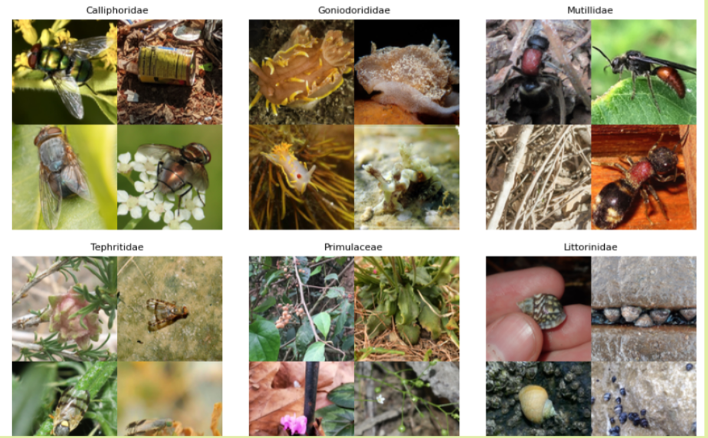

## Research Question: Which feature extraction method performs the best (i.e. creates the most separability for embeddings in embedding space)?
Feature extraction is a way to extract meaningful information from images in the form of image embeddings. In the world of deep learning, this is commonly done by way of convolutional neural networks (CNNs) but can also be done using other model architectures such as vision transformers (ViTs). For this research project, I compared the results (plots) of four feature extraction methods, all based on **CNN model architectures**, in the context of the "Clustering BioTrove" dataset. The following image shows an example of feature extraction performed in this experiment using a pretrained (on ImageNet) ResNet50 model to extract features at two different layers (layer 3 and layer 4 respectively to represent hierarchy of genus- and species-level features). This visualization was done using a density heatmap to show which parts of the input image were being "noticed" the most or "given the most importance" by the model at each extraction point.

This type of visualization makes feature extraction on images more intuitive as we can easily see what areas of the input image the model is "picking up on the most". However, this type of visualization is not practical for a large dataset, say 49,633 images like in the case of the Clustering BioTrove dataset. For that reason, image embeddings can be reduced to two dimensions using the Uniform Manifold Approximation and Projection (UMAP) library in Python. This allows us to visualize the resulting embedding(s) for each input image on a two-dimensional plot so that we can look at the resulting spread of the embeddings. In the context of the "Clustering BioTrove" challenge, and clustering problems in general, increased seperability of image embeddings can often lead to improved clustering. Below is an example of an embedding visualization from one of my models used in the "Clustering BioTrove" challenge. 

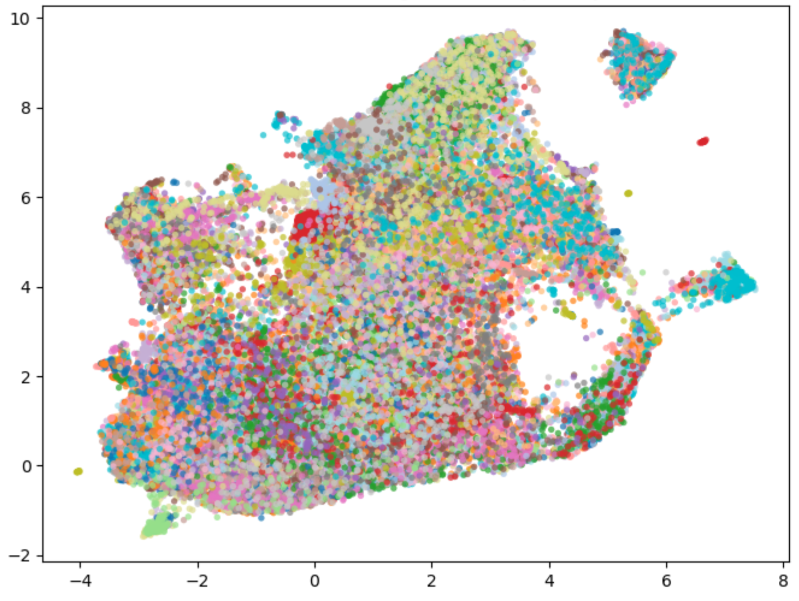

In this experiment, I compared four different feature extraction methods using the embedding visualization(s) from each method. This kind of metric is **subjective** by nature. I simply compared the visualizations by looking at them and determined which visualizations showed more seperability between image embeddings, and which showed less seperability. I operated under the general assumption that more seperability is better as it improves clustering performance. In reality, when it came to the "Clustering BioTrove" challenge, the results did not always reflect this. Somtimes models with "less-separated" embeddings scored higher than the models with "more-separated" embeddings. In fact, models that used the same clustering approach, but different feature extraction approaches, often scored very similarly suggesting that when evaluated using the NMI metric, the feature extraction method is not so impactful. However, the NMI metric on Kaggle was fairly easy to "hack" to achieve a high score with essentially no machine learning methods applied and so I don't completely have faith in NMI as a metric for evaluating clusters. As such, I stuck with the visual inspection approach to compare the resulting image embeddings from my feature extraction methods for the purpose of this experiment. 

I compared the following four feature extraction methods in this project:
  1. Single-layer ResNet50 
  2. Double-layer ResNet50 
  3. Double-layer ResNet101 
  4. Double-layer ResNet50 + supervised contrastive

Each of these methods includes some variation of the ResNet model. ResNet stands for "residual neural network" which is a type of convolutional neural network. Convolutional neural networks in general, are very powerful at extracting meaningful embeddings from input images, using matrices with specific values against the matrices of the original input image, to create transformations that highlight important features of the input image, namely edges. An example of this edge detection through use of a convolution can be seen in the following image from a [LinkedIn article by **Chen Yang**](https://www.linkedin.com/pulse/deep-learning-cnn-edge-detection-chen-yang/).

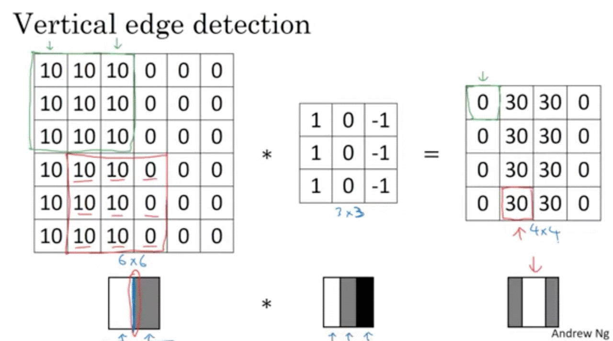
Yang, C. (2018, March 11). *Vertical Edge Detection* [infographic]. In C. Yang,
Deep Learning--CNN: Edge Detection, LinkedIn. https://www.linkedin.com/pulse/deep-learning-cnn-edge-detection-chen-yang/

A **very informative, intuitive, and interactive explanation** of how CNN models work can be found [here](https://poloclub.github.io/cnn-explainer/).

Basic CNN models, especially deep CNN models with many layers, suffer from something called **vanishing gradients** which hinders the models ability to backpropagate effectively through all of the layers and update the weights at each layer accordingly. Therefore, a more effective CNN architecture called the **"residual neural network"** (RNN) was introduced. ResNet models, compared to traditional CNNs, use residual blocks and skip connections to form identity shortcuts that shift learning from full transformations to residual increments. This allows very deep networks to learn meaningful representations efficiently by preserving useful information and easing optimization, rather than forcing each layer to relearn complete mappings. The following image shows a comparison of the VGG-19 CNN model, a plain 34-layer CNN, and a 34-layer residual neural network with **skip connections** shown with the "u"-shaped markings.

He, K., Zhang, X., Ren, S., & Sun, J. (2015). Figure 3 [Illustration of dimensionality change in residual blocks]. In Deep residual learning for image recognition (arXiv:1512.03385) arXiv. https://arxiv.org/pdf/1512.03385.pdf

The ResNet50 follows this same architecture however, it contains 50 convolutional layers instead of the 34 convolutional layers of ResNet34. A simplified diagram of the ResNet model architecture showing ResNet50, 101, and 152 model architectures can be seen below.

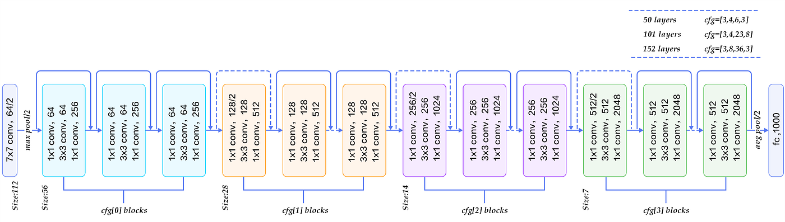
Rastogi, A. (2022, March 14). ResNet-50 architecture [Illustration]. In ResNet50. Dev Genius. https://blog.devgenius.io/resnet50-6b42934db431?gi=45d7a87dce82

Now let's take a look at each of the four extraction methods used in my research project more closely. 

### Single-layer ResNet50 feature extraction
This method involves extraction from a single layer, the final average global pooling layer, of the ResNet50 model, which is pretrained on ImageNet. The weights in the model are frozen, and each image does one pass through the model, until the final global average pooling layer, and then those embeddings are extracted and attached to a python object/variable. 
[Single-layer ResNet50 feature extraction code here](single-layer_ResNet50_feature_extraction.ipynb)

### Double-layer ResNet50 feature extraction
This method involves extraction from two layers in a pretrained (ImageNet) model: layer 3, with adaptive average pooling applied, and the final global average pooling layer. The double-layer extraction approach was taken to mimic the natural hierarchy of genus- and species-level features in living organisms which was important for the downstream task of clustering in the context of the "Clustering BioTrove" competition. The intuition was that earlier layers in the ResNet model would capture/highlight more general features that would lend themselves well to identifying genus distinctions while the later layers in the model would highlight more specific details that would lend themselves better to distinguishing between species.
[Double-layer ResNet50 feature extraction code here](double-layer_ResNet50_feature_extraction.ipynb)

### Double-layer ResNet101 feature extraction
This method was the exact same as the "Double-layer ResNet50 feature extraction" method except instead of a pretrained ResNet50 model, a pretrained ResNet101 model was used. The idea behind this was to compare the performance of a ResNet50 model and a ResNet101 model. Generally, deeper ResNet models perform slightly better than less deep ResNet models. In the context of the "Clustering BioTrove" competition, this was the case. The ResNet101 extraction method led to a slightly higher score.
[Double-layer ResNet101 feature extraction code here](double-layer_ResNet101_feature_extraction.ipynb)

### Double-layer ResNet50 + supervised contrastive feature extraction
This method made use of the second feature extraction method of extracting from two layers (3 and global avg. pool) of a ResNet50 model, but it added the concept of **supervised contrastive learning** onto the ResNet50 model via projection heads in order to make use of the provided **family label** for each input image to train the ResNet50 model in a way that would "keep" images from the same family "close together" and images from different families "farther apart". As the model trained, the weights of the ResNet50 model were updated to reflect this family label mapping structure and then the weights were frozen and each image was passed through the model as before, and embeddings were extracted at two layers as previously. The idea behind supervised contrastive learning can be seen in the image below. The top center image of the golden retriever is known as the **anchor** image. Each seperate image is compared to the anchor image and labeled as a positive (same) pair or as a negative (different) pair. Some of images are simly transforms of the original image - which can be helpful in supervised contrastive learning models. The model initially labeled the German shepherd dog as a negative pair but then in a subsequent epoch was able to correctly label the German shepherd and the golden retriever as a positive pair for the label of "dog".

Kundu, R. (2022, May 22). The beginner’s guide to contrastive learning. V7 Labs. https://www.v7labs.com/blog/contrastive-learning-guide

In the case of the "Clustering BioTrove" dataset with ~50k images and **only** family labels provided (in addition to unique identifier hash ids), the contrastive learning approach was a way to leverage the taxonomic family labels that were provided in the metadata csv. Every other extraction method I used was simply a frozen ResNet50 model with pretrained ImageNet weights. No labels or supervised learning could be leveraged in those methods. With this approach however, I was able to create a supervised learning situation, where family-labels being the same or different impacted the weights of the base ResNet50 model. In this way, I was able to tune the weights of the model, starting from the pre-trained ImageNet weights, to some extent, to my specific data - the BioTrove subset.
[Double-layer ResNet50 + **supervised contrastive feature extraction** code here](supervised_contrastive_feature_extraction.ipynb)

Finally, let's discuss the **visualization of image embeddings**. As stated before, image embeddings extracted through each of the four previously-mentioned approaches, were reduced to two dimensions so that they could be plotted and visualized. This dimensionality-reduction was done using the UMAP library in Python. These two-dimensional embeddings were then plotted using the seaborn library in Python. It is important to note that the UMAP parameters were kept **constant** across all feature extraction methods.

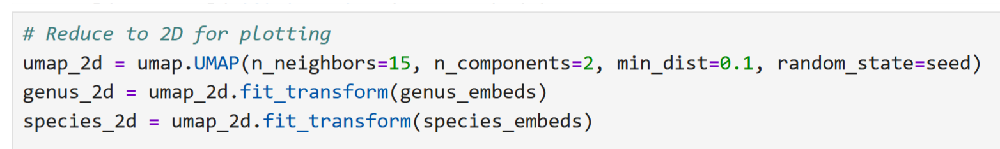

### Visualizations of embeddings by extraction method:
**NOTE: ALL EMBEDDINGS ARE COLORED BY FAMILY**

### Single-layer ResNet50 feature extraction

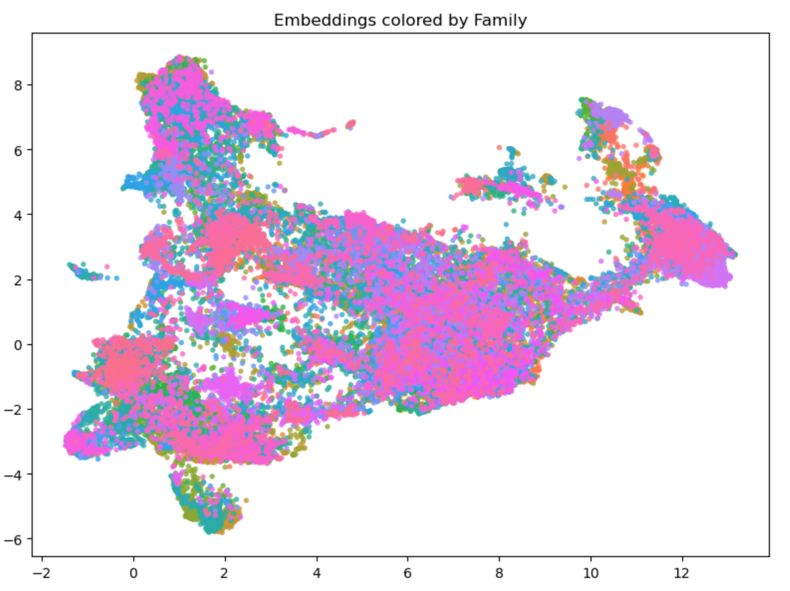

### Double-layer ResNet50 feature extraction

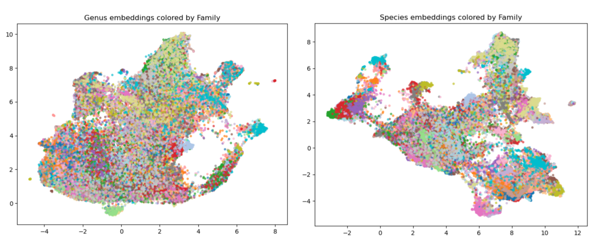

### Double-layer ResNet101 feature extraction
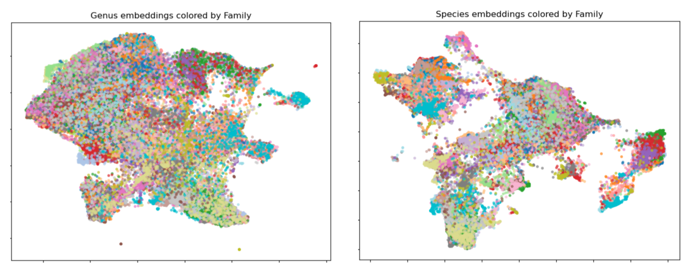

### Double-layer ResNet50 + supervised contrastive feature extraction
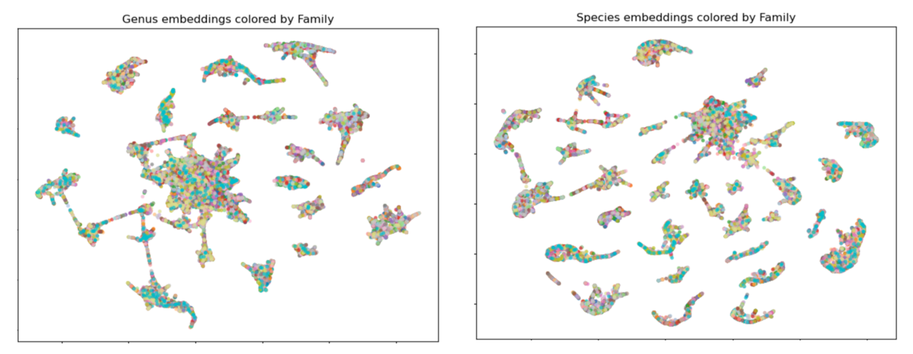

## Discussion

Comparing, all of the embedding visualizations, the single-layer ResNet50 embeddings stand out simply for the fact that there is only a single plot of embeddings as embeddings were only extracted from one layer in this method. Comparing the shape and distribution of the embeddings, they seem **more separated** than the genus-level embeddings from the ResNet50 AND ResNet101 double-layer extraction methods, but **less-separated** than the species-level embeddings from both of those extraction methods. Admittedly, I am not sure why this occurs but I speculate that this could be a result of this extraction method not being "tuned" to pick up on more general features at the genus level, and more specific features at the species level, like the ResNet 50 AND 101 double layer feature extraction methods are. As a result, perhaps this approach results in embeddings that are more in the middle of both specificity-levels of features (genus and species). 

The double layer feature extraction using ResNet50 and ResNet101 produce embeddings that are strikingly similar. It appears that the ResNet101 double layer-extracted embeddings are simply an inverted version of the same feature extraction method using a ResNet50 model. However, upon further inspection, there are some differences in the embeddings and I would say that the ResNet101 embeddings are slightly more separated than the ResNet50 embeddings. As mentioned previously, when using the same clustering approach in the "Clustering-BioTrove" challenge, the ResNet101 double-layer extracted model performed slightly better than the ResNet50 version which would suggest that the separability of extracted embeddings **influences** clustering performance. 

The embeddings from the double-layer ResNet50 + supervised contrastive feature extraction method are by far the most separable. The impact of trying to push images with different family labels apart is quite clear. However, when looking at the colors in each of the embedding plots for this extraction method, the same color, indicating the same family, can be seen in several different regions of the plot. This suggests that although embeddings seem to be very separated, members of the same family are far apart in the embedding space. To me this seems like the model needs to be tuned. The separability of the embeddings is promising but the unorganized color scheme suggests that separability may not lend itself well to the original downstream task of clustering into genus- and species-level groupings. This theory is supported by the fact that the model which used this feature extraction method in the "Clustering BioTrove" competition, performed slightly worse than the models which used the double-layer feature extraction method with ResNet50 and also with ResNet101.

