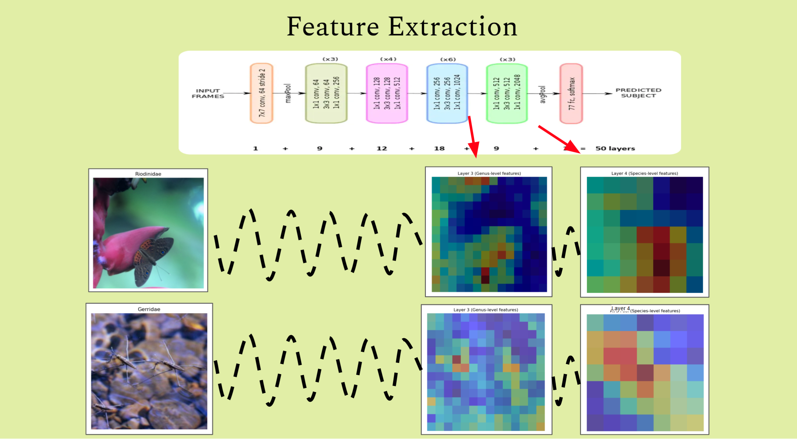

# Comparing-feature-extraction-methods-with-BioTrove-dataset
## Overview
This repo covers a research project that compared different deep learning/machine learning methods for feature extraction in images of living organisms. This project took place in the greater context of the ["clustering-biotrove"](https://www.kaggle.com/competitions/biotrove-clustering/overview) machine learning challenge on Kaggle. This challenge involved a subset of the original [BioTrove](https://baskargroup.github.io/BioTrove/) biodiversity dataset which contains over 160 million images of living organisms with taxonomic information included. The subset simply contained 50k images and **only taxonomic family labels**. The challenge is to use unsupervised learning (no genus or species labels provided) to produce genus- and species-level clusters. See the sections on the original BioTrove dataset and the Clustering BioTrove Challenge section for more information on each respective topic. The general appraoch of my team, BioTrove_1, was to use a deep learning approach for feature/embedding extraction from the images which would then allow for clustering of the images into genus- and species-level groupings. My research question for this project was to compare **four** different feature extraction methods from models that I designed to determine which approach resulted in better-defined embeddings when visualized using UMAP for dimension-reductionality.

## Note on useage of AI 
LLMs including ChatGPT, Gemini, and the Acanaconda Navigator, which uses several open-source LLM models, were used throughout this project to debug code and structure certain sections - particularly the custom dataset class, the supervised contrastive learning loss function, and the supervised contrastive learning model. 

## Scripting language & library
Code is in **Python** and the deep learning package used for analysis is **PyTorch**. 
Code is presented in the form of Jupyter notebooks.

## Repo structure - How to use this repo
To keep things clear and organized, this repo is broken up into **different sections in the main branch**. 
The README file includes the following:
  - Information on the original biotrove dataset
  - Information on the clustering biotrove challenge and the BioTrove data subset used for this challenge
  - A description of the research proejct/experiment which is the subject matter of this repository with visualizations of embeddings

The **code to reproduce** the results of **each of the four feature extraction methods** is **seperated into different files** in the main branch:
  - The **Data Preprocessing** file contains code to load in the clustering biotrove image dataset and metadata (49,633 image subset of original BioTrove dataset with corresponding metadata csv file), perform    transforms on images, custom dataset subclass, and dataloader. Since all four feature extraction methods function using the same preprocessing strategy, a seperate file has been used for this code. 
  - Each of the four extraction methods has its own, uniquely named section. Each individual section includes an explanation of the particular extraction method used as well as code to perform that method. The    four extraction method files include:
      - **Single-layer ResNet50 feature extraction**
      - **Double-layer ResNet50 feature extraction**
      - **Double-layer ResNet101 feature extraction**
      - **Double-layer ResNet50 + supervised contrastive learning feature extraction**
  - The **Embedding Visualization** file contains information on the visualization method used as wel as the code to visualize the embeddings extracted using any of the extraction methods listed above. Since only one visualization method was used, and it is compatible with all the extraction methods, the visualizaton method exists as an individual file.

My recommendation for **reproducing the experiment** is to open up a blank notebook (jupyter, colab, etc.), and **copy and paste the code** from the "Data Preprocessing" file, the desired feature extraction method file, and "Embedding Visualization" file into the notebook. Each individual file includes the import statements necessary for that specific code at the top and is designed to be ready to use as is. The **only edit necessary** is the addition of your **unique file paths** to the image directory and the metadata csv. **Instructions for downloading the data** are included in the Data Preprocessing file.

Lastly, a **Reflection** file is included in the main branch to communicate my reflections about the experiemnt: what worked, what didn't, and why?

## Background
### Original BioTrove Dataset
The original BioTrove dataset is described as "the largest publicly accessible dataset designed to advance AI applications in biodiversity". It was curated from the iNaturalist platform as part of an effort spanning several different universities in the United States, and includes 161.9 million images of living organisms with taxonomic information provided in metadata. It was released in 2024. A plethora of information about the original BioTrove dataset, including but not limited to: link to original paper, github repository, and example images, can be found ["here"](https://baskargroup.github.io/BioTrove/).

### Clustering BioTrove Challenge
The "Clustering BioTrove Challenge" was created by the ML+X machine learning organization from the University of Wisconsin-Madison as part of the 2025 Machine Learning Marathon competition. The challenge included a 49,633 image subset of the original BioTrove dataset with a corresponding metadata csv file that **only included** the unique image identifiers (**hash_id**), and **taxonomic family** names for the images. The goal of the challenge was to cluster the ~50k image dataset into genus- and species-level groupings with only the "hash_id" and "family" label provided for each individual image. I participated in this challenge in the Fall 2025 semester as part of the "BioTrove_1" team. This experiment occurs in the context of the "clustering-BioTrove" challenge because my team's general approach was to 1) extract image embeddings using a deep learning approach and then 2) cluster these embeddings into genus- and species-level groupings. As such, I spent a lot of time trying to find the best feature extraction method, visualizing embeddings to compare the results of different methods. This formed the basis for this research project which was used as my final project for the EnvirSt 900: AI for Earth Observation graduate-level course at the University of Wisconsin-Madison in the Fall 2025 semester. Although the competition was a team effort, the models used in this research project/experiment were created by me.

## Research Question: Which feature extraction method performs the best (i.e. creates the most separability for embeddings in embedding space)?
Feature extraction is a way to extract meaningful information from images in the form of image embeddings. In the world of deep learning, this is commonly done by way of convolutional neural networks (CNNs) but can also be done using other model architectures such as vision transformers (ViTs). For this research project, I compared the results of feature extraction on the "Clustering Biotrove" challenge dataset of ~50k images using different methods that were all based use of **CNN models**. The following image shows an example of feature extraction performed in this experiment using a pretrained (on ImageNet) ResNet50 model to extract features at two different layers of the model (layer 3 and layer 4 respectively to represent hierarchy of genus- and species-level features). This visualiazation was done using a density heatmap to show with parts of the input image were being "noticed" the most or "given the most importance" by the model at each extraction point (layer 3 and layer 4).

.

This type of visualization makes feature extraction on images more intuitive as we can easily see what areas of the input image the model is "picking up on the most". However, this type of visualization is note practical for a large dataset, say 49,633 images like in the case of the Clustering BioTrove dataset. For that reason, image embeddings can be reduced to two dimensions using the Uniform Manifold Approximation and Projection (UMAP) library in Python. This allows us to visualize the resulting embedding(s) for each input image on a two-dimensional plot so that we can look at the resulting spread of the embeddings. In the context of the "Clustering BioTrove" challenge, and clustering problems in general, increased seperability of image embeddings can often lead to improved clustering. Below is an example of an embedding visualization from one of my models used in the "Clustering BioTrove" challenge.

![Clustering BioTrove embedding visualization]

